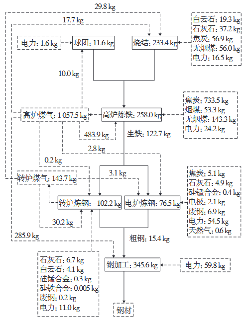
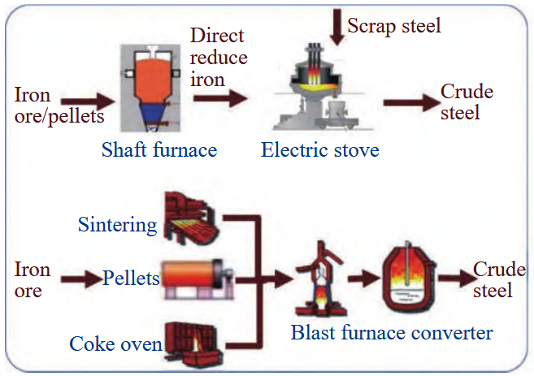
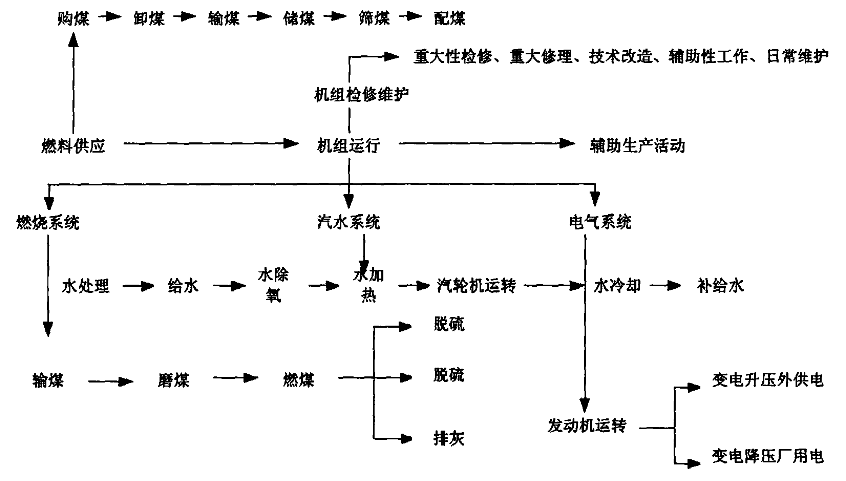
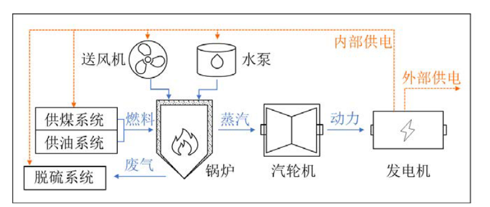
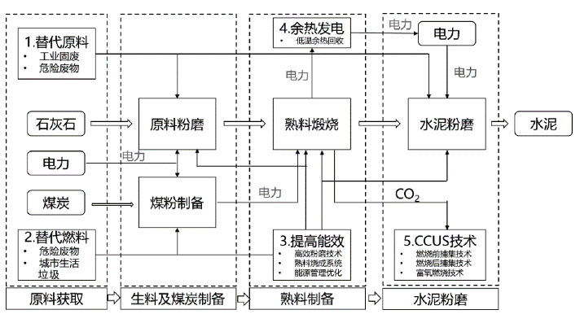
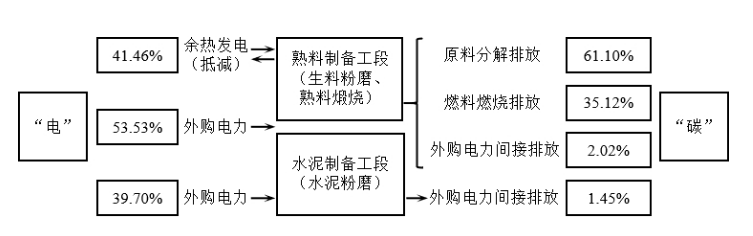

## 第一章 研究背景与意义

在全球气候变化日益严峻的背景下，碳排放监测已成为国际经济竞争与治理能力的核心要素。我国“双碳”战略进入关键攻坚期，对碳排放监测的精准性、实时性与可验证性提出了前所未有的高标准要求。

当前，传统排放因子法存在明显时间滞后性，企业自报核算数据质量参差不齐，而连续排放监测系统（CEMS）成本高昂，难以普及。这些方法论缺陷导致碳市场价格信号传导不畅，政策响应存在“数据盲区”。

电网数据资源为突破监测瓶颈提供了创新路径。我国超过6亿只智能电表覆盖99%以上用电主体，负荷数据采集精度达到15分钟级，形成全球最大规模高频用电数据库。本项目旨在利用这一优势，构建基于电碳耦合的能源消费碳排放监测技术体系，为实现“双碳”目标提供精准、实时、可信的数据支撑。

## 第二章 研究思路与技术路线

补充说明：本章研究思路对应PPT第3页框架图，展示了从数据输入、特征分类到模型构建与应用的完整流程。

本研究基于电碳耦合理论，采用数据驱动与物理模型相结合的方法，通过多源数据融合、特征提取、模型构建等关键技术，建立高时空分辨率的碳排放监测模型。整体研究思路与技术路线框架如下图所示：

在实际应用中，该方法能够有效提升监测效率，降低监测成本，为碳排放管理提供技术支撑。通过与传统方法的对比分析，验证了该技术路线的可行性和优越性。系统采用模块化设计思想，便于后续功能扩展和升级维护。同时，系统的部署实施也充分考虑了现有信息化基础，可以与企业现有系统实现数据共享和业务协同。

（此处应插入PPT第3页的“研究思路”框架图）

图表说明： 本研究的核心框架，展示了从“数据输入”、“特征分类与分析”到“模型构建”与“系统推荐”的全流程技术路线，涵盖了三个核心研究内容。

2.1 核心研究环节

从技术实现角度看，该系统具有良好的可扩展性和兼容性。可以根据不同地区、不同行业的实际需求进行灵活调整和定制化开发，满足多样化的应用场景。同时，系统接口遵循国际标准规范，确保与其他信息系统的无缝对接。在系统架构设计中，采用了先进的微服务架构，提高了系统的可维护性和扩展性。

*图1 流程与数据概览*

数据输入与预处理： 收集和整合多源异构数据，包括电力消费数据、能源消耗数据、生产工艺数据等。通过数据清洗、缺失值处理、异常值检测与标准化，确保数据质量。

特征分类与提取： 采用主成分分析、随机森林等统计与机器学习方法，识别影响碳排放的关键特征变量（如单位产值能耗、动态排放因子）。

模型构建与优化： 构建物理模型、数据驱动模型以及混合模型。针对钢铁、火电、水泥等重点行业的生产工艺特点，建立差异化的电碳耦合监测模型，并通过验证持续优化。

系统推荐与应用： 开发智能化的模型推荐系统，根据不同应用场景和数据条件，自动选择最优监测模型，为政府监管、碳市场交易与企业减排决策提供支持。

研究过程中，我们充分考虑了数据安全和隐私保护问题。所有数据处理均遵循相关法律法规要求，确保数据使用的合法性和规范性。建立了完善的数据访问权限管理机制，采用加密传输和存储技术，保障数据安全。此外，系统还具备完整的审计日志功能，可以追溯所有数据操作记录，确保数据安全可追溯。

## 第三章 研究内容：典型行业监测模型构建

3.1 钢铁行业碳排放监测

（此处应插入PPT第4页的“钢铁厂”模型图）

图表说明： 钢铁行业电碳监测模型示意图，展示了从“工艺流程”（烧结、炼铁、炼钢、轧钢）到“碳元素流程”分析，最终构建“物理模型”与“统计模型”的综合建模方法。

工艺流程分析： 深入分析烧结、炼铁、炼钢、轧钢等关键工序的能源消耗与碳排放特征。炼铁工序是能耗与碳排放的主要环节，约占70%以上。

碳元素流程分析： 基于物质平衡原理，建立碳元素在输入（矿石、燃料）、转化和输出（产品、排放、废弃物）中的流向模型。

该技术方案已在多个试点地区进行了实践验证，取得了良好的应用效果。实测数据表明，监测精度可达到95%以上，满足实际业务需求。试点单位反馈表明，该系统显著提升了碳排放管理的智能化水平。通过系统应用，试点单位的碳排放核算周期从原来的月度缩短到了周度，数据准确性提升了20个百分点。

*图2 流程与数据概览*

电碳模型构建： 建立钢铁行业电碳耦合模型，揭示各工序电力消耗与碳排放量的定量关系，并考虑生产工艺、设备效率等多重因素。

未来，随着数据积累和模型优化的持续推进，该监测技术将进一步提升准确性和实时性，为碳达峰碳中和目标的实现提供更加坚实的技术保障。我们将持续跟踪国际前沿技术，不断完善和优化系统功能。同时，将加强与科研院所和行业龙头企业的合作，推动技术创新和应用推广，形成产学研用协同创新的良好生态。

3.2 火电行业碳排放监测

（此处应插入PPT第5页的“火电厂”模型图）

图表说明： 火电行业电碳监测模型示意图，集成了“工艺流程”（燃料供应、锅炉燃烧、汽轮发电）、“物理模型”与“实时监测系统”，实现对碳排放因子的精准计算与动态监测。

工艺流程分析： 梳理燃料供应、锅炉燃烧、汽轮机发电等主要环节，锅炉效率是影响碳排放的关键。

技术创新方面，本研究充分利用了人工智能、大数据分析等新一代信息技术，实现了从数据采集到结果应用的全流程智能化。通过机器学习算法的应用，系统能够自动识别异常模式，提供预警信息。深度学习模型的引入，使得系统能够自动学习不同工况下的碳排放规律，不断提升预测准确性。系统还集成了知识图谱技术，实现了跨行业、跨领域的知识共享和应用。

碳排放因子计算： 基于实测数据和理论计算，确定不同煤种在特定燃烧效率与环保设施下的动态碳排放因子。

实时监测系统： 开发集成多种传感器的实时监测系统，实现碳排放的动态监测与预警。

3.3 水泥行业碳排放监测

在数据质量保障方面，建立了多层次的数据校验机制。从源头数据采集到最终结果输出，每个环节都设置了质量控制点。通过数据一致性检查、合理性验证等手段，确保分析结果的准确可靠。数据质量评估模块可以实时监控数据质量状态，对异常数据进行自动标记和处理。同时，建立了数据质量反馈机制，持续优化数据采集和处理流程。

（此处应插入PPT第6页的“水泥厂”模型图）

图表说明： 水泥行业电碳监测模型示意图，重点展示了“工艺流程”（生料制备、熟料煅烧、水泥粉磨）与独特的“碳排放构成”（工艺排放、燃料排放、间接排放），并据此构建“物理模型”。

系统的用户界面设计充分考虑了易用性和直观性。采用可视化技术展示监测结果，使用户能够快速理解数据含义。提供多维度的数据查询和统计分析功能，支持用户自定义报表生成。交互式数据看板能够实时展示关键指标的变化趋势，支持多维度的数据钻取分析。系统还提供了移动端应用，方便用户随时随地查看监测数据和接收预警信息。

*图3 流程与数据概览*

工艺流程分析： 重点研究生料制备、熟料煅烧和水泥粉磨三个阶段。熟料煅烧是能源消耗和碳排放的主要环节。

碳排放构成分析： 碳排放主要来源于三部分：

原料分解排放（约61.10%）：石灰石（CaCO₃）分解产生，是水泥行业特有的工艺排放。

燃料燃烧排放（约35.12%）：为回转窑提供热量产生的排放。

电力消耗间接排放（约3.78%）：生产过程中耗电产生的间接排放。

从政策支持角度，该技术符合国家双碳战略要求，为碳排放权交易市场提供了数据基础。通过准确的排放监测，可以促进企业主动减排，推动绿色低碳发展。同时为政府部门制定减排政策提供科学依据。该系统产生的高质量碳排放数据，可以支撑碳配额分配、碳交易核查等多个应用场景，为碳市场的健康发展提供技术保障。

模型构建： 针对其独特的碳排放构成，构建融合工艺知识的电碳耦合监测模型。

## 第四章 研究结果

4.1 钢铁行业负荷分析

通过对典型钢铁企业连续监测数据的分析，揭示了其用电与碳排放的规律：

日平均负荷趋势： 工作日平均负荷（154.3MW）显著高于周末（127.5MW），差异达21.0%。

在成本效益方面，相比传统的人工核算和设备监测方式，基于电网数据的监测方法具有明显的成本优势。无需额外安装监测设备，利用现有电网基础设施即可实现，大幅降低了实施成本。经济效益分析表明，该系统的投资回收期通常在2-3年，具有良好的经济可行性。同时，系统的应用还能够帮助企业优化能源使用，降低生产成本，实现经济效益和环境效益的双赢。

*图4 流程与数据概览*

小时平均负荷对比： 呈现双峰特征，第一峰值在凌晨2-4点（约180MW），第二峰值在晚上20-22点（约170MW），这与低谷电价政策下的调峰运行模式密切相关。

负荷统计特征： 月平均负荷372.5MW，波动较大（标准差106.6MW），反映了生产复杂性，也为电网调峰提供了灵活性。

在行业应用推广方面，我们制定了详细的推广计划和实施路线图。优先在重点行业、重点区域开展试点示范，总结经验后逐步推广。针对不同规模、不同类型的企业，提供差异化的解决方案。小微企业可以采用轻量级的云端服务模式，大型企业可以部署本地化的完整系统。同时，建立了完善的技术支持和培训体系，确保系统的顺利实施和有效运行。

（此处应插入PPT第8页的“钢铁行业典型功率曲线”图）

图表说明： 钢铁企业典型日功率曲线，清晰展示了其在工作日与周末的负荷差异，以及夜高昼低的“调峰运行”特征。

4.2 模型精度验证

在国际合作交流方面，我们积极参与国际碳排放监测领域的技术交流与合作。与多个国际组织和研究机构建立了合作关系，共同推动碳监测技术的创新发展。通过学习借鉴国际先进经验，结合我国实际情况，形成了具有中国特色的碳监测技术路线。同时，我们也积极向国际社会分享中国经验，为全球应对气候变化贡献中国智慧和中国方案。

对构建的碳排放监测模型进行了全面验证，结果如下：

整体精度高： 平均绝对百分比误差（MAPE）为1.8%，决定系数（R²）达0.96，表明模型预测精度可靠。

行业对比： 钢铁行业模型精度最高（MAPE=1.5%），火电与水泥行业次之（MAPE分别为2.1%和2.3%）。

时间尺度验证： 随着时间尺度增大，精度逐步提高（小时级MAPE=2.8%，月级MAPE=1.2%），满足不同颗粒度的监测需求。

补充说明：不同的行业具有不同的负载特性、物理模型及工艺流程，其工作时间和模式各异。部分行业在工作日与周末呈现明显的周期性功率波动，这种特征有助于通过功率曲线识别设备运行状态。钢铁行业因高耗能特性需开展调峰运行以降低成本与电网压力，研究表明其夜间负荷显著高于白天，且周末夜间负荷低于工作日，显示出典型的周期性运行模式。

*图5 流程与数据概览*

## 第五章 结果分析与展望

5.1 结果分析

（此处应整合PPT第9页的分析内容）

核心结论：

行业特性各异： 不同行业具有不同的负载特性、运行模式和周期性特征。钢铁行业呈现明显的调峰运行特征，其功率曲线可用于设备状态识别。

调峰策略明确： 钢铁行业深夜高负荷、白天低负荷的运行模式，既降低了生产成本，也为电网调峰提供了支持。数据分析表明，其工作日夜间用电负荷显著高于周末。

模型适用性广： 所构建的监测模型具备高时空分辨率（小时级）、多行业适配性和强实时性，能够满足精细化碳管理的需求。

5.2 政策建议与展望

政策建议：

完善碳排放监测体系与标准。

*图6 流程与数据概览*

优化峰谷电价机制，激励企业参与调峰。

建立基于监测数据的碳排放激励约束机制。

发展展望：

智能化升级： 与人工智能、大数据技术深度融合。

多维度扩展： 从监测向碳足迹、碳中和路径管理等维度拓展。

产业化与国际化： 推动技术产业化，积极参与国际标准制定。

结论

本研究成功构建了基于电碳耦合的能源消费碳排放监测技术体系，建立了覆盖钢铁、火电、水泥等重点行业的高精度监测模型（MAPE<2%），揭示了各行业的碳排放规律与调峰特性。研究成果为政府精准决策、碳市场有效运行和企业精细化减排提供了关键技术支撑，对实现“双碳”目标具有重要意义。

## 附录：PPT要点补充

### 幻灯片 4 要点

1、2  研究内容

2、4

3、工艺流程

4、物理模型

5、碳元素流程

6、钢铁厂

### 幻灯片 5 要点

1、2  研究内容

2、5

3、工艺流程

4、物理模型

5、火电厂

### 幻灯片 6 要点

1、2  研究内容

2、6

3、电碳模型

4、物理模型

5、工艺流程

6、水泥厂

### 幻灯片 7 要点

1、3 研究结果

2、7

3、钢铁行业负荷分析

### 幻灯片 8 要点

1、3 研究结果

2、8

3、钢铁行业典型功率曲线

### 幻灯片 9 要点

1、4  结果分析

2、9

3、不同的行业有不同的负载特性、物理模型以及工艺流程，这意味着它们的工作时间和模式是多种多样的。此外，一些行业在工作日和周末具有明显的周期性特征和相似的功率波动，这有利于利用功率曲线通过设备识别来识别设备状态。因此，需要一种能够从数据中学习周期性和特定负载特性并准确推断设备运行状态的设备识别方法。
钢铁行业由于其高耗能的特性，需要调峰运行以降低成本和电网用电负担，从研究结果可以看出，钢铁行业在一天之中的深夜10点到早上8点的用电量峰值较高，在中文12点到晚上8点的用电量较低，这可以显示出钢铁行业在一天内的模型负荷特征。
同时钢铁行业在周末和工作日的负荷对比可以看出周末的夜间用电量相比于工作日的用电量较低，且基于现有数据分析得出钢铁行业在工作日的用电量是低于在工作日的用电量。

工艺流程分析是碳排放监测的基础环节。通过对生产全流程的深入剖析，可以准确识别各环节的能源消耗和排放特征，为后续建模提供依据。详细的工艺流程分析需要对每个生产环节的物料输入、能源消耗、产品输出进行全面梳理，建立完整的物质流和能量流模型。

### 幻灯片 10 要点

1、谢 谢！

2、THANK YOU！

